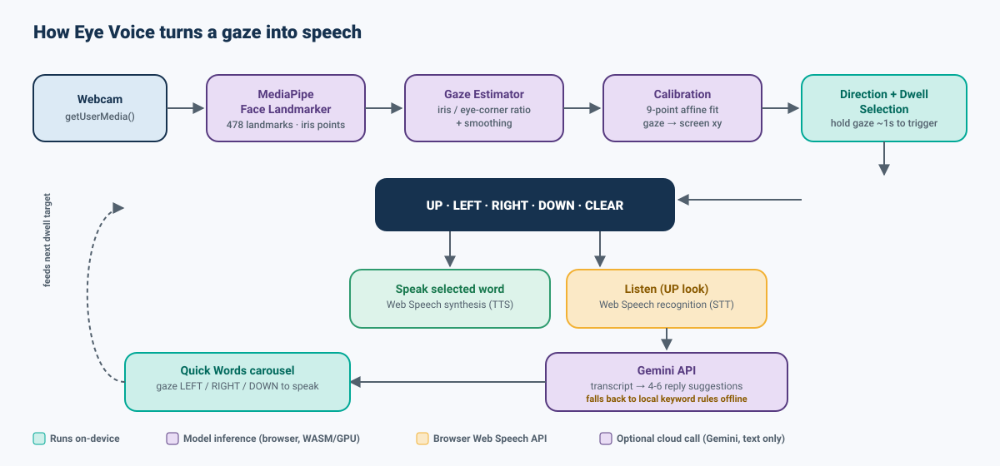
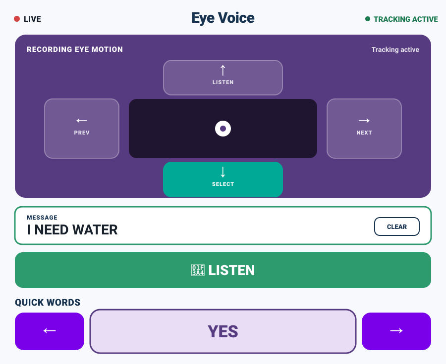

<div align="center">


<br>

[](#)
[](#)
[](#)
[](#)
[](#license)

**A hands-free communication board for people with limited mobility — controlled entirely by looking up, down, left, or right.**

[The problem](#the-problem-by-the-numbers) • [Features](#features) • [Scientific background](#scientific-background) • [How it works](#how-it-works) • [Getting started](#getting-started) • [Using Eye Voice](#using-eye-voice) • [Project structure](#project-structure) • [Privacy](#privacy--data-handling) • [References](#references)

</div>

---

## About

**Eye Voice** turns a webcam into an assistive communication device. It tracks the user's iris position in real time, maps it to four directions on screen, and lets the user build and speak short messages using nothing but eye movement and dwell time — no mouse, keyboard, or touch required.

It's a static, dependency-free web app: open `index.html` (or serve the folder) and it runs. Face tracking happens fully client-side via [MediaPipe Face Landmarker](https://developers.google.com/mediapipe/solutions/vision/face_landmarker); video is never uploaded anywhere.

## The problem, by the numbers

Losing the ability to speak or move rarely means losing the ability to think or to look. The conditions below all can leave eye movement as one of the few — sometimes the only — channels a person has left, which is exactly the gap gaze-based AAC (Augmentative and Alternative Communication) tries to close.

| Condition / metric | Figure | Source |
|---|---|---|
| People worldwide who cannot rely on natural speech to communicate | **~97 million** | [ASHA](https://www.asha.org/njc/aac/) |
| People who actually use an AAC device or system today | **~2 million** (a small fraction of those who could benefit) | [ASHA](https://www.asha.org/njc/aac/) |
| Americans who cannot rely on natural speech | **~5 million** | [ASHA](https://www.asha.org/njc/aac/) |
| Global ALS (motor neurone disease) prevalence | **5.05 per 100,000**, projected to rise ~25% by 2040 as populations age | [Vasta et al., *Annals of Clinical and Translational Neurology*, 2026](https://onlinelibrary.wiley.com/doi/10.1002/acn3.70226) |
| ALS patients who develop dysarthria (impaired speech) | **80–95%**, of whom ~60% eventually need AAC | [Target ALS](https://targetals.org/news/how-als-affects-speech/) · [ALS News Today](https://alsnewstoday.com/speech-problems/) |
| Bulbar-onset ALS patients who lose functional speech within ~3 years | **60–70%** | [ALS News Today](https://alsnewstoday.com/speech-problems/) |
| Americans living with some form of paralysis | **~5.36 million** (1.7% of the population) | [Christopher & Dana Reeve Foundation](https://www.christopherreeve.org/todays-care/paralysis-help-overview/stats-about-paralysis/) |
| People living with spinal cord injury in the U.S. (end of 2024) | **~308,620**, with ~18,000 new cases/year | [Reeve Foundation / MSKTC](https://www.christopherreeve.org/todays-care/paralysis-help-overview/stats-about-paralysis/) |
| Leading cause of locked-in syndrome (near-total paralysis with intact cognition and eye movement) | **Stroke — 86.4%** of cases; traumatic brain injury accounts for most of the rest | [PMC systematic review, 2021](https://www.ncbi.nlm.nih.gov/pmc/articles/PMC8402869/) |
| Children under 5 living with cerebral palsy worldwide | **~8.1 million (1.2%)** | [*Lancet Global Health*, 2025](https://www.thelancet.com/journals/langlo/article/PIIS2214-109X(25)00268-2/fulltext) |
| Typical price of a commercial eye-gaze speech-generating device | **US $3,000–$15,000+** for new hardware | [Inclusive Technology](https://www.inclusive.com/collections/hardware-eye-gaze-technology) · [Tobii Dynavox](https://www.tobiidynavox.com/collections/devices) |

**The access gap is the core problem Eye Voice targets**: dedicated infrared eye-gaze speech-generating devices are clinically excellent but cost thousands of dollars, often require funding approval, and can take weeks to arrive. Eye Voice trades some tracking precision (see [Scientific background](#scientific-background)) for **zero hardware cost** — it runs on any laptop or phone with a standard RGB webcam — as a stopgap, a low-stakes way to try gaze control before committing to clinical hardware, or a fallback when a dedicated device isn't available.

## Features

- 👁️ **Real-time eye tracking** — 478-point face mesh via MediaPipe, iris position sampled at ~30 fps with GPU acceleration (CPU fallback if unavailable)
- 🎯 **9-point calibration** — fits a personal affine gaze-to-screen model so accuracy adapts to each user's face and camera position
- ⏱️ **Dwell-to-select input** — hold a gaze on a direction to trigger it, with a visual radial progress ring and configurable dwell time (700 ms – 1500 ms)
- 🧭 **Four-direction control scheme** — `↑` Listen · `↓` Select & Speak · `←` Previous word · `→` Next word
- 🗣️ **Text-to-speech output** — selected words/phrases are spoken aloud via the Web Speech API, with voice and language selection
- 🎙️ **Voice input** — dictate a need or question via speech recognition, transcribed live on screen
- ✨ **AI-assisted suggestions** — sends the transcript to the Gemini API for 4–6 contextual reply suggestions, with an offline keyword-matching fallback if no key is set or the request fails
- ♿ **Accessibility-first UI** — large touch targets, high-contrast focus states, `prefers-reduced-motion` support, live regions for screen readers, keyboard-operable fallback for every gaze target
- ⚙️ **Adjustable sensitivity & dwell time** — tunable per user in Settings, persisted in `localStorage`
- 🔒 **Camera-local processing** — video frames never leave the device; only a typed transcript (if you choose to use Listen) is sent to Gemini

## Scientific background

Eye Voice sits at the intersection of two established research areas: **appearance-based gaze estimation** (inferring where someone is looking from an ordinary camera image, without dedicated infrared hardware) and **dwell-time gaze interaction** (using sustained fixation as a selection mechanism in place of a mouse click). Neither is novel research on its own — the contribution here is combining freely available, browser-native building blocks into a device-free, zero-install AAC tool.

**Gaze estimation.** Classic eye trackers use infrared illumination and a corneal-reflection ("glint") model to achieve sub-degree accuracy, but that requires dedicated hardware. Eye Voice instead uses *appearance-based* estimation from a plain RGB webcam: MediaPipe's Face Landmarker locates 478 3D face landmarks per frame — 468 from its Attention Mesh face model plus 10 dedicated iris landmarks (5 per eye) refined by an attention mechanism specifically over the eye regions. A published review of 40 studies on visible-light, low-cost-camera eye tracking found an average accuracy of **2.69° of visual angle**; more recent appearance-based methods report **1.1–1.4°** in controlled conditions, and the underlying iris model can estimate camera-to-face distance to within **<10% error** with no special hardware. Consumer webcam gaze estimation is therefore roughly **an order of magnitude less precise** than infrared trackers — which is precisely why Eye Voice avoids fine-grained cursor control and instead classifies gaze into **five coarse zones** (`UP`/`DOWN`/`LEFT`/`RIGHT`/`CENTER`), a task far more tolerant of a few degrees of error.

**Reducing noise.** Raw per-frame iris ratios are noisy, so [`gazeEstimator.js`](js/gazeEstimator.js) applies an exponential moving average: `smoothed = previous + (raw - previous) * α`, with `α` (0.18 / 0.28 / 0.42) tunable via the Sensitivity setting — lower `α` favors stability over responsiveness, higher `α` reacts faster but admits more jitter. This is the same low-pass-filter approach commonly used to stabilize noisy pointer signals in HCI systems, traded off against latency.

**Personal calibration.** Because face geometry, camera angle, and lighting vary per user, [`calibration.js`](js/calibration.js) collects gaze samples at **9 fixed screen points** and solves a **least-squares affine fit** (`screen = A·gaze_x + B·gaze_y + C`, solved separately for x and y via Gaussian elimination on the 3×3 normal-equations matrix) — the same class of model classic 5–9 point eye-tracker calibration routines use to correct for per-user offset and scale before any classification happens.

**Dwell-time selection.** Selecting a target by holding your gaze on it (rather than blinking, or an external switch) is a well-studied AAC input technique. Foundational HCI research on gaze typing found that a **fixed** dwell time yields roughly **5–10 words per minute** for novices, while an *adjustable* dwell time that shortens with practice raised throughput from **6.9 → 19.9 WPM over ten sessions** (dwell time falling from 876 ms → 282 ms, error rate from 1.28% → 0.36%) — with more recent work confirming gaze typing tends to plateau around **~20 WPM** once dwell thresholds drop to roughly 240–340 ms. This is also a hard mathematical ceiling: since one selection cannot complete faster than the dwell threshold `t_d`, throughput is bounded by `1 / t_d`. Eye Voice's default **1000 ms** dwell (adjustable 700–1500 ms in Settings) sits deliberately on the conservative, error-resistant end of that published range, favoring reliability for a coarse 5-target layout over the raw speed of a full on-screen keyboard.

| Design parameter | Eye Voice default | Range offered | Grounded in |
|---|---|---|---|
| Dwell time (`js/settings.js`) | 1000 ms | 700–1500 ms | Majaranta & Räihä dwell-time / speed-accuracy tradeoff research |
| Smoothing factor `α` (`gazeEstimator.js`) | 0.28 (medium) | 0.18 (low) – 0.42 (high) | EMA / low-pass filtering of noisy appearance-based gaze signal |
| Direction threshold (`app.js`) | 0.11 (medium) | 0.07 (high sens.) – 0.16 (low sens.) | Compensates for ~2–3° typical webcam gaze error by using coarse zones, not a cursor |
| Calibration points (`calibration.js`) | 9-point grid | — | Standard affine/polynomial calibration grid size in eye-tracking literature |

## How it works

<div align="center">

</div>

1. **Capture** — the webcam feed is read locally via `getUserMedia`.
2. **Landmark detection** — [`EyeTracker`](js/eyeTracking.js) runs MediaPipe's Face Landmarker on each video frame (GPU delegate, falling back to CPU) to extract 478 face/iris landmarks, roughly every 33 ms (~30 fps).
3. **Gaze estimation** — [`gazeEstimator.js`](js/gazeEstimator.js) computes each iris center relative to its eye-corner bounding box (`(iris − min) / (max − min)` in x and y), averages both eyes into one normalized gaze vector, then applies the exponential smoothing described above.
4. **Calibration** — [`calibration.js`](js/calibration.js) walks the user through 9 on-screen points, holds each for ~1.7 s, averages at least 8 gaze samples per point, and fits the affine model described above. The model is cached in `localStorage` so returning users skip recalibration.
5. **Direction + dwell selection** — the calibrated gaze point is classified into `UP` / `DOWN` / `LEFT` / `RIGHT` / `CENTER` against the sensitivity threshold, with hysteresis (a smaller "hold" band) so natural micro-jitter near a boundary doesn't repeatedly flicker the active direction. Holding a direction fills a dwell ring ([`dwellSelection.js`](js/dwellSelection.js)) and fires the action once it completes.
6. **Output** — a selected word is spoken via `speechSynthesis`; looking `UP` starts speech recognition, and the resulting transcript is sent to the Gemini API for reply suggestions (or handled by a local rule-based fallback in [`suggestions.js`](js/suggestions.js) if no key is configured or the network call fails).

## Preview

<div align="center">


<sub>UI preview — recreated from the live app for illustration. Run it locally to see your own camera feed and tracking overlay.</sub>
</div>

## Getting started

Eye Voice has **no build step and no dependencies to install** — it's plain HTML/CSS/JS loaded as ES modules, with MediaPipe fetched from a CDN at runtime.

### Prerequisites

- A modern browser with camera access and Web Speech API support (Chrome or Edge recommended)
- A webcam
- Any static file server (ES modules can't be loaded from `file://`)

### Run locally

```bash
git clone https://github.com/<your-username>/eye-voice.git
cd eye-voice
python -m http.server 4173
```

Then open **http://localhost:4173** and click **Start Eye Tracking**.

> A ready-made launch config for this exact command is already in [`.claude/launch.json`](.claude/launch.json) if you're using Claude Code.

Any other static server works too, e.g. `npx serve .` or the VS Code "Live Server" extension.

## Using Eye Voice

1. **Grant camera access** on the start screen — video is processed locally and never recorded or uploaded.
2. **Calibrate** — look at each of the 9 dots as they appear and hold steady; this builds your personal gaze model.
3. **Navigate with your eyes**:

   | Direction | Action |
   |---|---|
   | ↑ Up | Start / stop voice listening |
   | ↓ Down | Select the current quick word and speak it |
   | ← Left | Previous quick word |
   | → Right | Next quick word |

4. **Speak your need faster** — look `UP`, say what you need, look `UP` again to stop. Eye Voice transcribes it and (if a Gemini key is set) offers short, relevant reply suggestions in the quick-words carousel.
5. **Adjust settings** — dwell time, sensitivity, voice, language, and your own Gemini API key are all in the **Settings** panel and persist across sessions (the API key persists only for the current browser tab/session).
6. **Recalibrate anytime** from Settings if tracking drifts (e.g. you moved, or lighting changed).

### Using AI suggestions (optional)

Suggestions work fine without any setup — you'll get sensible offline keyword-based suggestions out of the box. To enable smarter, context-aware suggestions:

1. Get a free API key from [Google AI Studio](https://aistudio.google.com/apikey).
2. Paste it into the **Gemini API key** field in Settings.
3. The key is kept only in `sessionStorage` for that browser tab — it is never written to disk or committed to the repo.

## Project structure

```
Eye tracking/
├── index.html                 # App shell & markup
├── css/
│   ├── style.css              # Layout, theme, camera panel, carousel
│   └── accessibility.css      # Focus states, reduced-motion, a11y helpers
├── js/
│   ├── app.js                 # Wires everything together, main frame loop
│   ├── camera.js              # getUserMedia webcam setup
│   ├── eyeTracking.js         # MediaPipe Face Landmarker integration
│   ├── gazeEstimator.js       # Iris ratio → gaze vector, smoothing, direction
│   ├── calibration.js         # 9-point calibration & affine gaze mapping
│   ├── dwellSelection.js      # Dwell-timer based selection logic
│   ├── settings.js            # Dwell/sensitivity persistence
│   ├── speechRecognition.js   # Web Speech API (STT) wrapper
│   ├── textToSpeech.js        # Web Speech API (TTS) wrapper
│   ├── suggestions.js         # Offline keyword-based suggestion fallback
│   ├── geminiSuggestions.js   # Gemini API request + response parsing
│   └── geminiConfig.js        # Local dev key placeholder (empty by default)
└── assets/screenshots/        # README images
```

## Privacy & data handling

- Camera video is processed **entirely in the browser** and is never recorded, stored, or transmitted.
- The gaze calibration model is stored only in your browser's `localStorage`, scoped to that browser/device.
- If you use **Listen**, the transcribed **text** (not audio or video) is sent to Google's Gemini API solely to generate reply suggestions. This only happens if you've provided your own API key.
- No analytics, tracking, or third-party scripts are included beyond the MediaPipe model files (fetched from Google's CDN) and, optionally, the Gemini API call described above.

## Roadmap ideas

- [ ] Configurable word banks / custom vocabularies per user
- [ ] Server-side proxy for the Gemini key so it never touches the client at all
- [ ] Additional language support for speech recognition & synthesis
- [ ] Session logging/export for caregivers (opt-in, local-only)

## Contributing

Issues and pull requests are welcome. Since this is a dependency-free static app, please keep changes framework-free and test in-browser before submitting (see [Getting started](#getting-started)).

## License

Distributed under the MIT License. See `LICENSE` for details (add one if it isn't present yet).

## References

**The problem / statistics**
- [ASHA — Augmentative and Alternative Communication (AAC)](https://www.asha.org/njc/aac/)
- [Vasta et al., "Amyotrophic Lateral Sclerosis Prevalence Projection in 2040", *Annals of Clinical and Translational Neurology*, 2026](https://onlinelibrary.wiley.com/doi/10.1002/acn3.70226)
- [ALS News Today — ALS prevalence projected to rise sharply worldwide by 2040](https://alsnewstoday.com/news/als-prevalence-projected-rise-sharply-worldwide-2040/)
- [Target ALS — How ALS Affects Speech](https://targetals.org/news/how-als-affects-speech/)
- [ALS News Today — ALS speech problems](https://alsnewstoday.com/speech-problems/)
- [Christopher & Dana Reeve Foundation — Spinal Cord Injury Prevalence in the U.S.](https://www.christopherreeve.org/todays-care/paralysis-help-overview/stats-about-paralysis/)
- [PMC — Locked-In Syndrome: A Systematic Review of Long-Term Management and Prognosis (2021)](https://www.ncbi.nlm.nih.gov/pmc/articles/PMC8402869/)
- [*The Lancet Global Health* — Cerebral palsy in young children: bridging the global data gap (2025)](https://www.thelancet.com/journals/langlo/article/PIIS2214-109X(25)00268-2/fulltext)
- [Inclusive Technology — Eye Gaze Technology & Eye Tracking Devices](https://www.inclusive.com/collections/hardware-eye-gaze-technology)
- [Tobii Dynavox — Assistive technology devices for AAC](https://www.tobiidynavox.com/collections/devices)

**Gaze estimation science**
- [Evaluation of Appearance-Based Methods and Implications for Gaze-Based Applications (arXiv:1901.10906)](https://arxiv.org/pdf/1901.10906)
- [Frontiers in Robotics and AI — Webcam-based gaze estimation for computer screen interaction (2024)](https://www.frontiersin.org/journals/robotics-and-ai/articles/10.3389/frobt.2024.1369566/full)
- [Democratizing eye-tracking? Appearance-based gaze estimation with improved attention branch, *ScienceDirect*](https://www.sciencedirect.com/science/article/pii/S0952197625004944)
- [MediaPipe Iris — Real-time Iris Tracking & Depth Estimation](https://github.com/google/mediapipe/blob/master/docs/solutions/iris.md)

**Dwell-time interaction research**
- [Majaranta, Ahola & Špakov, "Fast Gaze Typing with an Adjustable Dwell Time", CHI 2009](https://homepages.tuni.fi/oleg.spakov/publications/Majaranta_CHI_09.pdf)
- [Majaranta, MacKenzie et al., "Effects of feedback and dwell time on eye typing speed and accuracy"](https://www.yorku.ca/mack/uais2006.html)
- [ACM CHI 2025 — There Is More to Dwell Than Meets the Eye: Toward Better Gaze-Based Text Entry Systems](https://dl.acm.org/doi/full/10.1145/3706598.3713781)

---

<div align="center">
<sub>Built to give a voice back to people who can't use their hands or speech to communicate.</sub>
</div>
